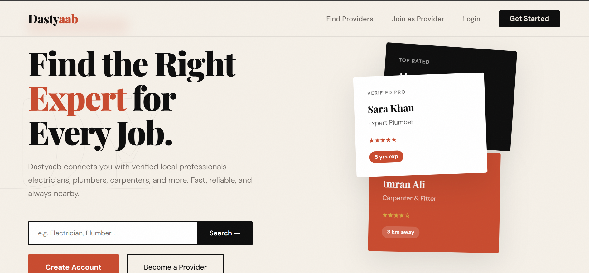
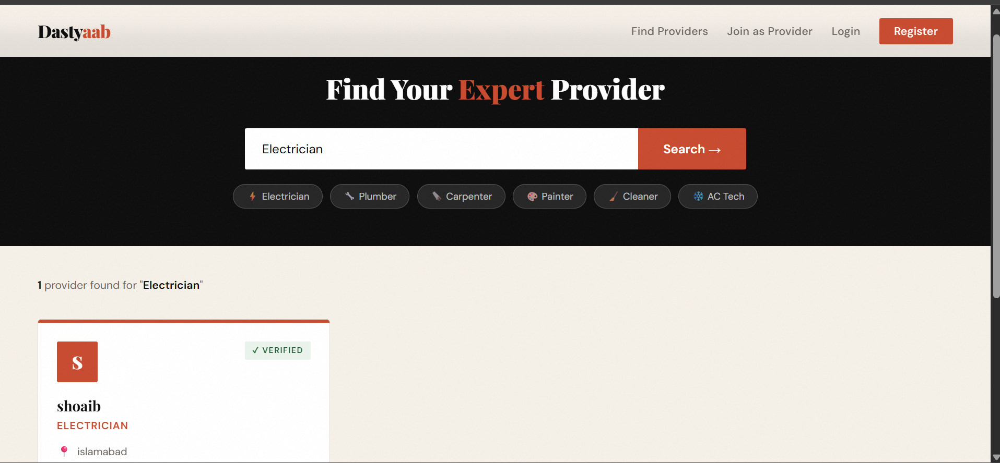
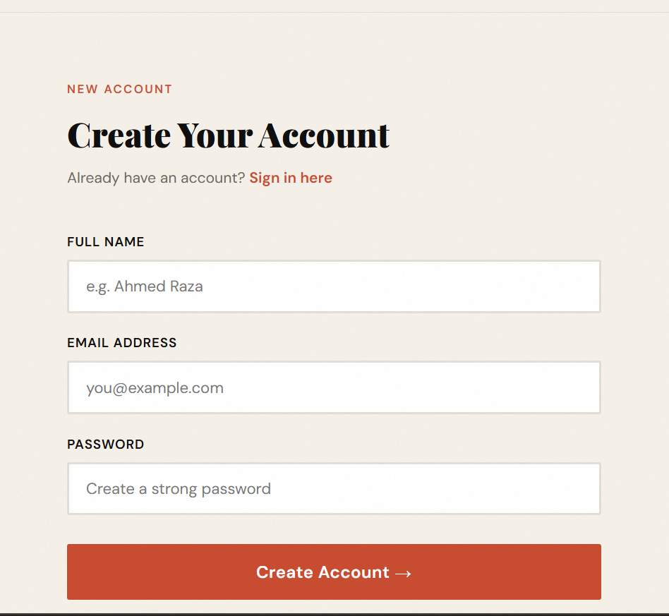
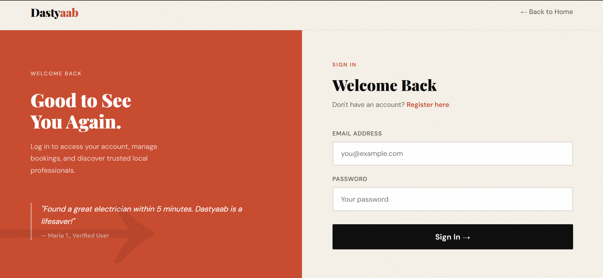
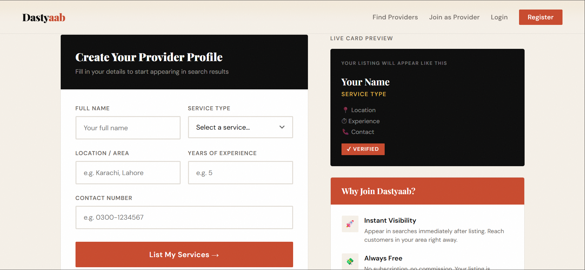

# Dastyaab — Local Service Provider Platform

<div align="center">



**A full-stack web platform connecting users with verified local service professionals.**

[](https://nodejs.org)
[](https://expressjs.com)
[](https://mongodb.com)
[](https://developer.mozilla.org)
[](LICENSE)

</div>

---

## Table of Contents

- [About the Project](#about-the-project)
- [Key Features](#key-features)
- [Tech Stack](#tech-stack)
- [Project Structure](#project-structure)
- [Screenshots](#screenshots)
- [Getting Started](#getting-started)
- [API Reference](#api-reference)
- [Roadmap](#roadmap)
- [Author](#author)

---

## About the Project

**Dastyaab** (دستیاب — meaning *"Available"* in Urdu) is a full-stack web platform that bridges the gap between everyday users and local service professionals in Pakistan.

Whether you need an electrician at midnight or a plumber on a weekend, Dastyaab makes it effortless to find, compare, and contact verified local experts — in seconds.

> Built as a real-world full-stack project demonstrating end-to-end web development skills including RESTful API design, MongoDB database modeling, and responsive UI/UX design.

---

## Key Features

### For Users
- **Account Registration & Login** — Secure user authentication with form validation and feedback messages
- **Service Search** — Search providers by service category with instant dynamic results
- **Provider Cards** — Browse verified providers with name, service, location, experience, and contact info
- **Quick Filters** — One-click category chips for Electrician, Plumber, Carpenter, Painter, and more
- **Save Providers** — Bookmark providers for later reference

### For Service Providers
- **Provider Profile Creation** — List your service with full professional details
- **Live Card Preview** — See exactly how your listing looks as you fill the form
- **Instant Visibility** — Appear in search results immediately after listing
- **Direct Contact** — Customers can call you directly from your provider card

### Platform
- **Responsive Design** — Fully works on desktop, tablet, and mobile
- **Professional UI** — Warm editorial design with a cohesive color system and custom typography
- **RESTful API** — Clean, structured backend endpoints
- **MongoDB Integration** — Persistent data storage with Mongoose ODM

---

## Tech Stack

| Layer | Technology |
|---|---|
| Frontend | HTML5, CSS3, Vanilla JavaScript |
| Backend | Node.js, Express.js |
| Database | MongoDB, Mongoose ODM |
| Typography | Playfair Display + DM Sans (Google Fonts) |
| Dev Tools | Nodemon, MongoDB Compass |

---

## Project Structure
```text
Dastyaab/
│
├── backend/
│   ├── models/
│   │   ├── User.js              # User schema (name, email, password)
│   │   └── Provider.js          # Provider schema (name, service, location, experience, contact)
│   │
│   ├── routes/
│   │   ├── auth.js              # POST /api/register, POST /api/login
│   │   └── provider.js          # POST /api/provider, GET /api/providers
│   │
│   ├── server.js                # Express server entry point
│   └── package.json             # Backend dependencies
│
└── frontend/
├── index.html               # Landing page
├── register.html            # User registration
├── login.html               # User login
├── search.html              # Search and browse providers
├── provider.html            # Provider profile creation
│
└── css/
├── style.css            # Shared design system (variables, navbar, buttons, footer)
├── index.css            # Homepage specific styles
├── register.css         # Registration page styles
├── login.css            # Login page styles
├── search.css           # Search page styles
└── provider.css         # Provider page styles
```
## Screenshots

### Home Page


### Search & Browse Providers


### User Registration


### User Login


### Join as Provider


---

## Getting Started

### Prerequisites

Make sure you have the following installed on your machine:

- [Node.js](https://nodejs.org) v18 or higher
- [MongoDB](https://mongodb.com) Community Edition (local)
- A modern web browser

### Installation

**Step 1 — Clone or download the repository**

Download the ZIP from GitHub and extract it, or clone it:
```bash
git clone https://github.com/yourusername/dastyaab.git
cd dastyaab
```

**Step 2 — Install backend dependencies**
```bash
cd backend
npm install
```

**Step 3 — Start MongoDB**

Make sure MongoDB is running on your machine:
```bash
# Windows
net start MongoDB
```

**Step 4 — Start the backend server**
```bash
node server.js
